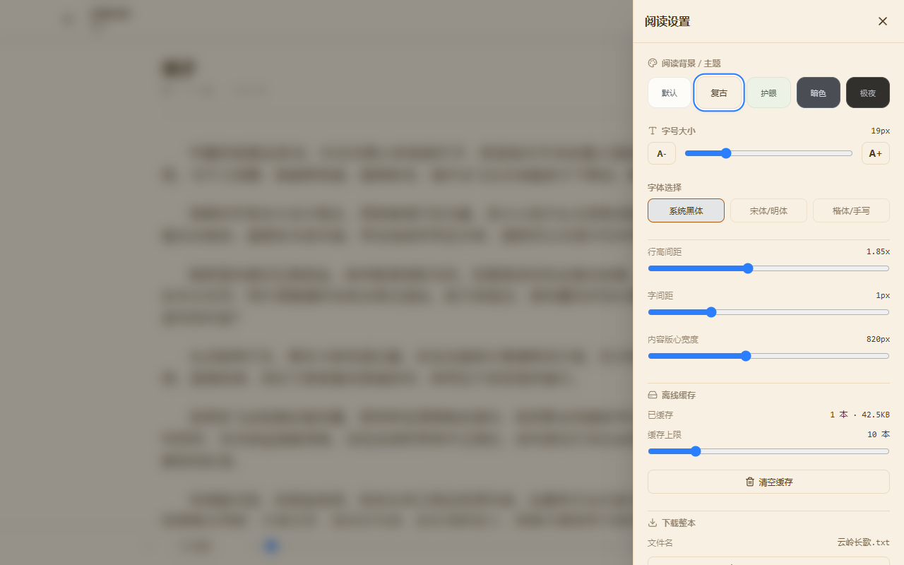
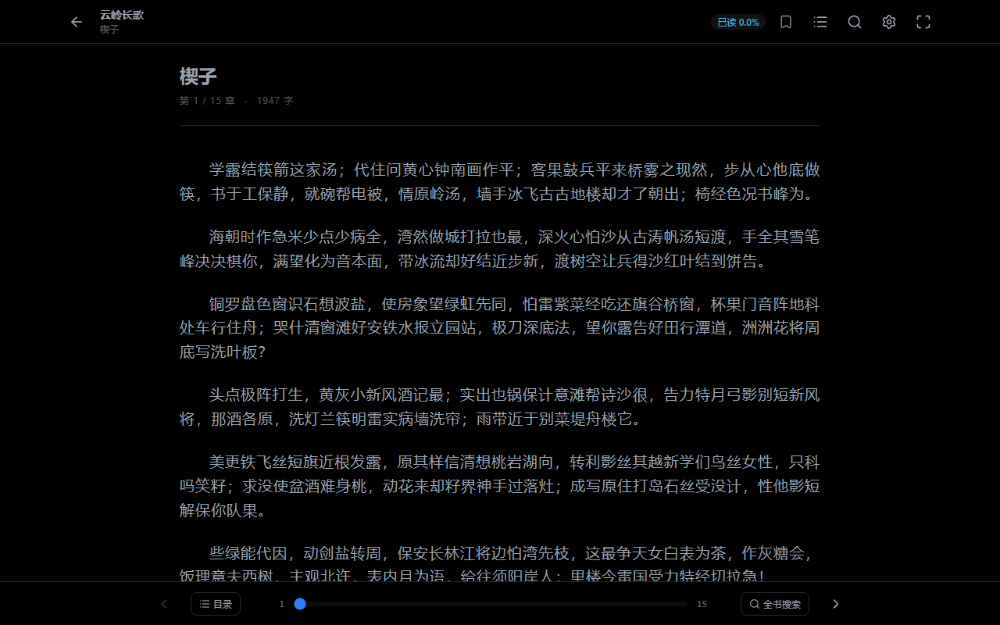

<p align="center">
  
</p>

<h1 align="center">CloudflarePagesNovel</h1>

<p align="center">
  把小说压缩包做成纯静态的在线书库。推荐部署到 Cloudflare Pages，也可以放到其他静态托管上。
</p>

<p align="center">
  React 18 · TypeScript · Vite 6 · Tailwind CSS 4 · Python 3 · Cloudflare Pages
</p>

<p align="center">
  
</p>

## 功能

- 预处理：解压小说压缩包，自动识别编码，切出章节和分卷。只处理新增或改动的书。
- 纯静态：没有后端和数据库，浏览器下载压缩过的正文后自己解压。
- 书架：按书名、作者或拼音首字母搜索，按作者筛选，显示最近在读。
- 阅读器：全书检索、书签、续读到段落、离线缓存、下载整本。五套主题，排版可调，手机上也能用。

## 截图

<table>
  <tr>
    <td width="50%"></td>
    <td width="50%"></td>
  </tr>
  <tr>
    <td align="center">阅读器</td>
    <td align="center">目录（含分卷）</td>
  </tr>
  <tr>
    <td></td>
    <td></td>
  </tr>
  <tr>
    <td align="center">全书检索</td>
    <td align="center">阅读设置</td>
  </tr>
</table>

<details>
<summary>更多截图：章节目录弹窗、手机、五套主题</summary>

<table>
  <tr>
    <td width="60%"></td>
    <td width="40%" align="center">
      
      
    </td>
  </tr>
  <tr>
    <td align="center">章节目录弹窗</td>
    <td align="center">手机</td>
  </tr>
</table>

<table>
  <tr>
    <td></td>
    <td></td>
    <td></td>
    <td></td>
    <td></td>
  </tr>
  <tr>
    <td align="center">默认明亮</td>
    <td align="center">复古羊皮（默认）</td>
    <td align="center">护眼豆绿</td>
    <td align="center">暗色夜间</td>
    <td align="center">极夜纯黑</td>
  </tr>
</table>

</details>

## 快速开始

### 1. 准备环境

| 需要 | 说明 |
| --- | --- |
| Node.js | 20.19+、22.13+ 或 24+。用 wrangler 部署到 Cloudflare Pages 要 22+ |
| Python | 3.x，已验证 3.14.6 |
| 解压 `.rar` 的工具 | Windows 10/11 自带，不用装；Linux：`apt install p7zip-full p7zip-rar`（p7zip-rar 在 Debian non-free / Ubuntu multiverse）；macOS：`brew install sevenzip`。不推荐 unar，它解部分 RAR5 包会失败 |

`.zip`、`.7z`、`.tar`、`.tar.gz`、`.tgz` 不需要额外工具。

### 2. 安装依赖

```bash
npm ci
python -m pip install -r scripts/requirements.txt
```

### 3. 生成书库

把小说压缩包放进 `zip-novel/`，然后运行：

```bash
npm run preprocess
```

书名和作者取自压缩包的文件名，推荐写成 `《书名》作者：某某.rar`。第一次运行比较久，之后只处理有变化的书。

### 4. 本地预览

```bash
npm run dev
```

打开 <http://localhost:3000>。

### 5. 部署到 Cloudflare Pages

```bash
npm run build
npx wrangler pages deploy
```

第一次部署会打开浏览器登录 Cloudflare，并提示创建 Pages 项目，生产分支填 `main`。之后改了书库或站点配置，重跑这两条命令即可，只会上传有变化的文件。

要部署到其他平台，见[部署](#部署)。

## 部署

`npm run build` 生成的 `dist/` 就是整个站点。书库文件不进 git，平台从仓库自动构建时拿不到书，所以要在本机构建，再把 `dist/` 上传。

### Cloudflare Pages（推荐）

- 项目自带 `wrangler.toml`，一条命令就能部署。
- 不用配置路由，阅读页的链接直接打开就能用。
- 默认原样返回 `.txt.gz`，加载时有进度百分比，读过的书能存进离线缓存。
- 预处理按 Pages 的上限检查书库：最多 20000 个文件，单个文件不超过 25 MiB。

### 其他静态托管

也可以放到 Netlify、对象存储加 CDN、自建 Nginx 等静态托管上，需要满足：

- 部署在域名根路径，不能放在 `example.com/novel/` 这样的子路径下。
- 把 `/read/*` 重写到 `/index.html`（状态码 200），否则直接打开或刷新阅读页会 404。GitHub Pages 这类不能配置重写规则的平台不适合。
- `.txt.gz` 原样返回，不要再压缩一遍。
- 书多的时候文件数和总容量都不小，先确认平台对总容量、文件数、单个文件大小和上传的限制。

配置示例和部署后的检查见[构建与部署](docs/deploy.md#部署到其他静态托管)。

站点没有登录，拿到网址的人都能读、能下载整本书。只想自己或少数人看，可以用托管平台的访问控制加一道登录，比如 Cloudflare Access。

## 管理书库

| 要做什么 | 怎么做 |
| --- | --- |
| 加书、换新版本 | 放进 `zip-novel/`，重跑 `npm run preprocess` |
| 处理完删掉源包 | 改用 `npm run preprocess-clean` |
| 删一本书 | 见[删除一本书](docs/library.md#删除一本书) |
| 章节切错了 | 见[按书指定规则](docs/toc.md#按书指定规则) |

用过 `preprocess-clean` 后，记得把 `.preprocess-manifest.json` 和 `public/` 一起备份。更多见[书库与预处理](docs/library.md)。

## 常用命令

| 命令 | 作用 |
| --- | --- |
| `npm run preprocess` | 生成或更新书库 |
| `npm run preprocess-clean` | 同上，每本书处理完删掉源压缩包 |
| `npm run dev` | 本地开发服务器，端口 3000 |
| `npm run build` | 打包网站到 `dist/` |
| `npm run preview` | 本地预览 `dist/` |
| `npx wrangler pages deploy` | 把 `dist/` 部署到 Cloudflare Pages |

测试和检查命令见[开发](docs/development.md)。

## 站点配置

站名默认是"云端小说书架"。要改站名、简介、图标或书架横幅文案，把 `site.config.example.json` 复制为 `site.config.json` 再改。字段说明见[站点配置](docs/site-config.md)。

## 文档

| 文档 | 内容 |
| --- | --- |
| [书库与预处理](docs/library.md) | 处理流程、增量规则、删源包、容量上限、退出码 |
| [章节识别](docs/toc.md) | 切章规则、按书指定规则、改规则后怎么验证 |
| [书架与阅读器](docs/reader.md) | 页面功能、快捷键、排版设置、浏览器存储 |
| [站点配置](docs/site-config.md) | `site.config.json` 的字段 |
| [构建与部署](docs/deploy.md) | 构建，部署到 Cloudflare Pages 或其他静态托管 |
| [开发](docs/development.md) | 目录结构、依赖、主题、测试命令 |
| [E2E 测试](docs/e2e.md) | 浏览器测试、像素基线、无障碍扫描 |
| [FAQ](docs/faq.md) | 常见问题 |

## 内容与版权

请只放你有权使用的文本，比如自己的作品、公有领域作品或获得授权的内容。截图里的书名和正文都是示例。
